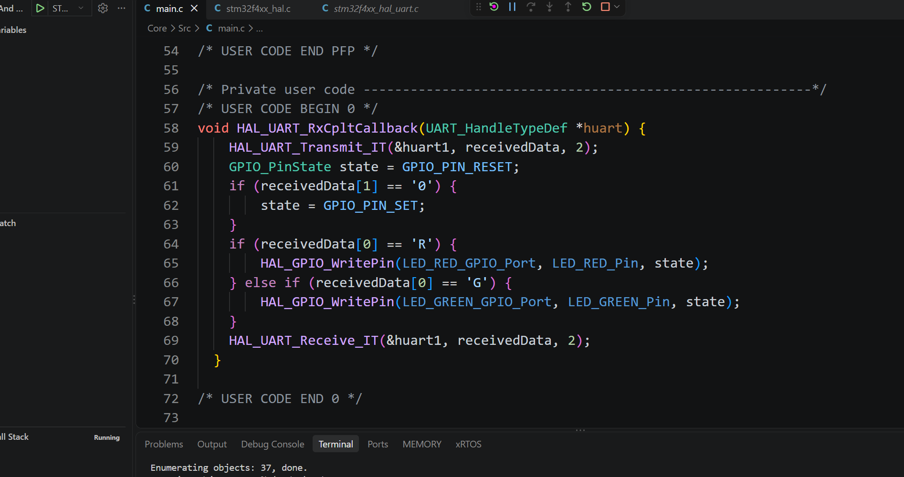

<<<<<<< HEAD
\# 嵌入式 9.26 实践：回环点灯

\## 截图

!\[回环点灯截图](assets/01.png)

!\[回环点灯截图](assets/02.png)

\## 说明

使用can回环静默模式：自收自发，在接收回调中反转小灯电平。

=======
# 嵌入式 9.26 第一节课作业 - 串口
## 截图

## 说明
dma收发的工程代码，及成功与电脑通信的截图。
>>>>>>> f1db8d1a6bf2b4ec15f3bd6ecdd383c4ca975886
